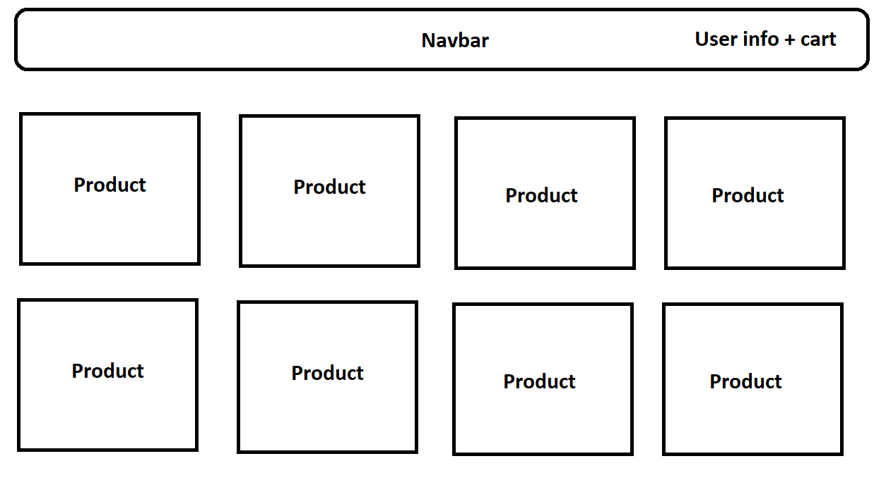

<br />
<h5 align="center" style="padding:0;margin:0;">Glen Dorner</h5>
<h5 align="center" style="padding:0;margin:0;">221358</h5>
<h6 align="center">DV200 | Term 3</h6>
</br>
<p align="center">

  <a href="https://github.com/GlenDorner221358/Papito--REAL-">
    
  </a>

<h3 align="center">Paptio</h3>

  <p align="center">
    This is a mock up stationery website that connects to my mongoDB databse and displays everything from there. CRUD functionality included!<br>

   <br />
   <br />

</p>
<!-- TABLE OF CONTENTS -->

## Table of Contents

- [About the Project](#about-the-project)
    - [Project Description](#project-description)
    - [Built With](#built-with)
- [Getting Started](#getting-started)
    - [Prerequisites](#prerequisites)
    - [How to install](#how-to-install)
- [Features and Functionality](#features-and-functionality)
- [Concept Process](#concept-process)
    - [Ideation](#ideation)
    - [Wireframes](#wireframes)
- [Development Process](#development-process)
    - [Implementation Process](#implementation-process)
        - [Highlights](#highlights)
        - [Challenges](#challenges)
    - [Future Implementation](#peer-reviews)
- [Final Outcome](#final-outcome)
    - [Mockups](#mockups)
    - [Video Demonstration](#video-demonstration)
- [Conclusion](#conclusion)

<!--PROJECT DESCRIPTION-->

## About the Project

### Project Description

Welcome to Papito! A stationery website that displays everything dynamically from MongoDB! Featuring full (almost) CRUD functionality, you can create, read, update and delete the products and orders that we stock! Log in using your user ID, dont give this out to anyone!! Its like a username and a password in one!

### Built With

HTML5
REACTJS
CSS
Node
Express
Mongoose
MongoDB
Bootstrap 5
Axios

<!-- GETTING STARTED -->
<!-- Make sure to add appropriate information about what prerequesite technologies the user would need and also the steps to install your project on their own mashines -->

## Getting Started

These instructions will get you a copy of this project up and "running" on your local machine for testing.

### Prerequisites
You can use insomnia to directly access the mongo database, but that is optional
Seeing as you cant connect to my mongoDatabase (you dont have the env file) here is how you can setup a table of your own:
1. In your mongo collection, create 3 tables [products, orders and users] and set them up as is shown in the models folder on the serverside
2. Create an ENV file in the serverside with your mongoDB details
3. Set up the connection URL's in the routes folder and in every single other file (you can ctrl + F the urls to change them quicker)
4. Cd into the client folder and run npm i to install all the node modules you will need
5. Do the same with the server folder
6. npm run dev in the server folder
7. npm start in the client folder
8. Done :)


### Installation

Here are a couple of ways to clone this repo:

1.  GitHub Desktop </br>
    Enter `https://github.com/GlenDorner221358/Papito--REAL-` into the URL field and press the `Clone` button.

2.  Clone Repository </br>
    Run the following code in the command-line to clone the project to your machine:

    ```sh
    git clone https://github.com/GlenDorner221358/Papito--REAL-
    ```

After downloading the code, run through the prerequisites checklist.

## Features and Functionality

<!-- note how you can use your gitHub link. Just make a path to your assets folder -->

You cannot really use this for anything other than what I was using it for. Maybe as a library for an endless stream of axios calls?

<!-- CONCEPT PROCESS -->
<!-- Briefly excplain your concept ideation process -->
<!-- here you will add things like wireframing, data structure planning, anything that shows your process. You need to include images-->

## Concept Process

As soon as the term started I knew I wanted a stationery website with a silly name, so I made papito. At the time I had no clue how anything worked, so I kept all my planning vague.


### Wireframes

<!--  -->




## Development Process

The `Development Process` is the process gone through to create the program.

### Implementation Process

Because this was written in REACT, using 100 million different modules and external programs, the scope of the implementation process is almost too wide to describe fully.
I used each of the languages as mentioned above, as well as MongoDB to make a database and insomia to access the database externally. Each page was written with react.


#### Highlights

Some Highlights I experienced during coding.

- Every time I added a new CRUD feature I got really happy
- Re-learning how to use session storage was way easier than I thought it would be
- Not having to go to DV lectures anymore during my vacation is a major plus
- When I just quickly implemented the 'latest products' feature I felt very impressed with myself.


#### Challenges

Some challenges I faced during development, including issues I solved or didn't:

- Axios sometimes just refuses to work. CheckoutDingus line 40 something there is an axios.get call that is supposed to get a singular object when I click a button. It doesn't do that. For absolutely no reason. When I click the button AGAIN without refreshing the page, THEN it works, and I have to click it A THIRD TIME to get more code working, after which it just breaks.
- Learning how to do CRUD functions on my own sucked.
- Every time I realised I had to update the schema for something and clear all my past entries in the database and make new ones, my heart broke. This happened so many times I stopped doing it lmao.
- I learned you cannot use a use state inside of a loop, which made me upset.
- The back issues I developed from sitting for this long.


### Future Implementation
Here I outline some things I could add or improve in the future.

- Fix the checkout add order system. (idk how to do that)
- Fix the login screen so that you can log in regularly instead of with a user ID.
- Change the product schema to accept variations and the amount in stock as well.


## Final Outcome
### Mockups

#### Landing

#### Products

<br>

<!-- VIDEO DEMONSTRATION -->
### Video Demonstration
[View Demonstration](https://drive.google.com/file/d/105kSyHAv8YPMI85b2tJa7bMq_TMPq20e/view?usp=sharing)

<!-- AUTHORS -->

## Author
- **Glen Dorner** - [Github](https://github.com/GlenDorner221358)

<!-- ACKNOWLEDGEMENTS -->

## Acknowledgements

- [Figma](https://www.figma.com/)
- [VScode](https://code.visualstudio.com/)
- [Insomnia](https://insomnia.rest/download)
- [MongoDB](https://www.mongodb.com/)
- [Bootstrap](https://getbootstrap.com/docs/5.0/getting-started/introduction/)
